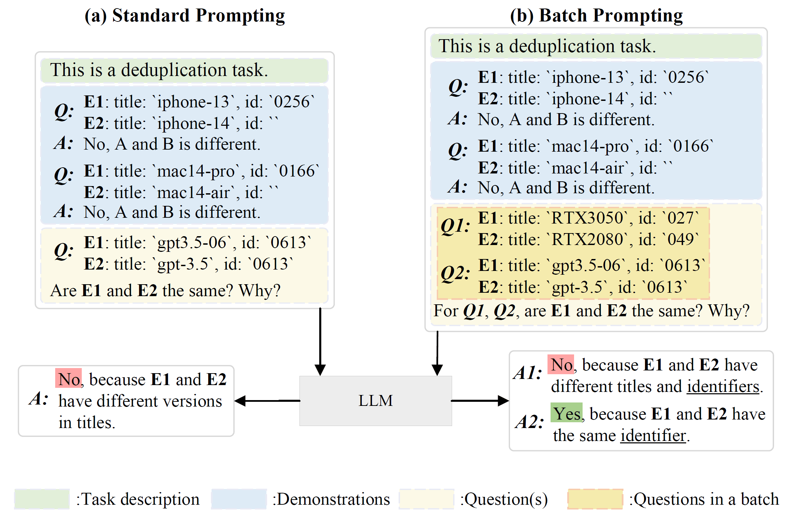

# BatchER


This repository contains source code for the paper "Cost-Effective In-Context Learning for Entity Resolution: A Design Space Exploration". In this paper, we provide a comprehensive study to investigate how to develop a cost-effective batch promptingapproach to ER.We introduce a framework BATCHER consisting of demonstration selection and question batching and explore different design choices that support batch prompting for ER. We also devise a covering-based demonstration selection strategy that achieves an effective balance between matching accuracy and monetary cost. We conduct a thorough evaluation to explore the design space and evaluate our proposed strategies. Through extensive experiments, we find that batch prompting is very costeffective for ER, compared with not only PLM-based methods fine-tuned with extensive labeled data but also LLM-based methods with manually designed prompting. We also provide guidance for selecting appropriate design choices for batch prompting.



## Code Structure

```sh
|-- data # folder of datasets for Entity Resolution
|-- figs # folder of figures
|-- outputs # folder of outputs and log files, seen more in "## Quick Start / ### Results"
|-- src # folder of source files
    |-- helper.py # some auxiliary functions
    |-- model.py # some models
    |-- prompting.py # prompting methods and class
|-- batcher.py # main function of batchER
|-- bp_vs_sp.py # compare batch prompting and standard prompting
|-- exp.py # experiment class
```

## Datasets

We publish 8 datasets of Entity Resolution. Each dataset contains `train.json` / `valid.json` / `test.json`.

file_name | dataset
:----------:|:----------:
abt-buy | Abt-Buy
em-ag | Amazon-Google
em-beer | Beer
em-da | DBLP-ACM
em-ds | DBLP-Scholar
em-fz | Fodors-Zagats
em-ia | iTunes-Amazon
em-wa | Walmart-Amazon

More details can be found in our paper.

## Quick Start

### Step 1: Environment Set up

Before install packages, use conda to create an enveriment `batcher` with `python==3.9.13`:

```bash
conda create -name batcher python==3.9.13
```

Then, install necessary packages with `requirements.txt`

```bash
pip install -r requirements.txt
```

### Step 2: Run

Our code is designed for one-click execution. But before execution, you should: 

1. go to the project path: `cd ./batcher/`
2. fill the `keys.txt` with OPENAI API keys. To facilitate user testing, we provide three keys for free, seen in `keys.txt`.

**(1) Run the code to compare Batch Prompting and Standard Prompting**

```bash
python bp_vs_sp.py
```

**(2) Run BatchER**

You can run BatchER in two modes:

- `run_all`: reproduce the main results in our paper

```bash
python batcher.py --run_all
```

- run specific variants of BatchER, for example, if you want to run `diverse_batch + covering_based` on dataset `WA`:

```bash
python batcher.py --dataset_name "em-wa" --pkg_type "diverse" --demo_selection "covering"
```

### Results

After that, all results will be saved in `/outputs/`. A complete structure of results:

```sh
|-- outputs
    |-- feature_extractor # main results
        |-- StructureAware-ratio # structure aware feature extractor based on Levenshtein Ratio
            |-- em-wa # datasets
            ... ...
        |-- StructureAware-jaro_winkler # structure aware feature extractor based on jw similarity
            |-- em-wa
        |-- SemanticAware-SBERT # semantic aware feature extractor based on SBERT embedding
            |-- em-wa
    |-- BPvsSP # compare batchprompting and standard prompting
        |-- em-wa # datasets
            |-- trial1 # one trial
                |-- BatchPrompting # results of BatchPrompting
                |-- StandardPrompting # results of StandardPrompting
            |-- trial2
            ... ...
        ... ...
```

We also provide the experimental log of BatchER, seen in dir `outputs/__batcher_results_in_paper/`